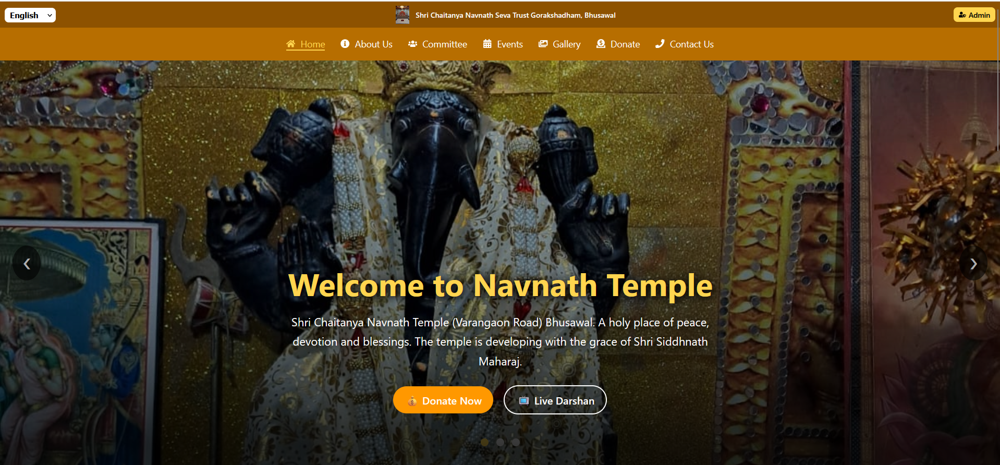
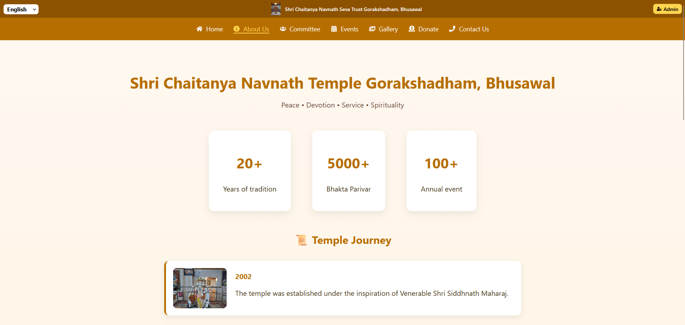
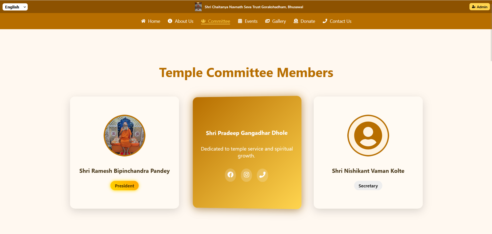
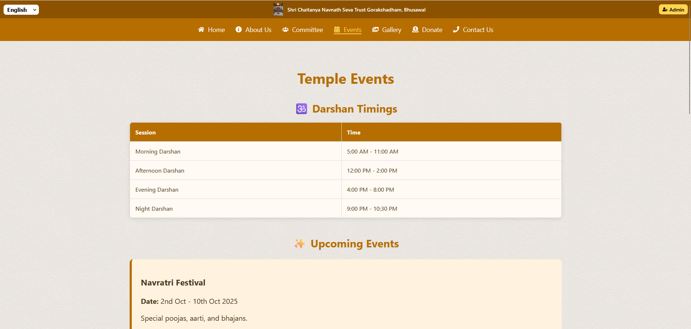
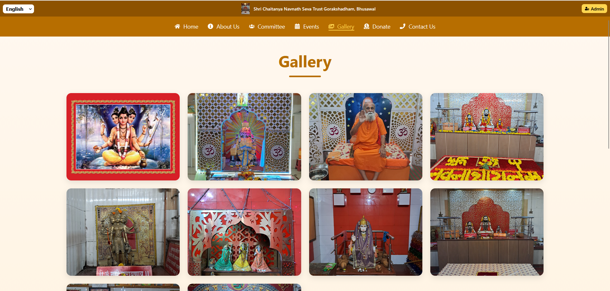
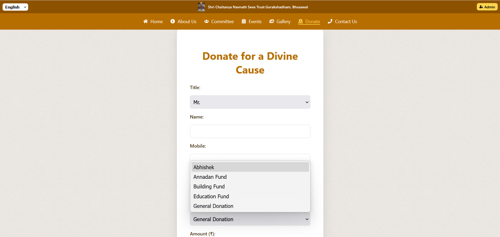
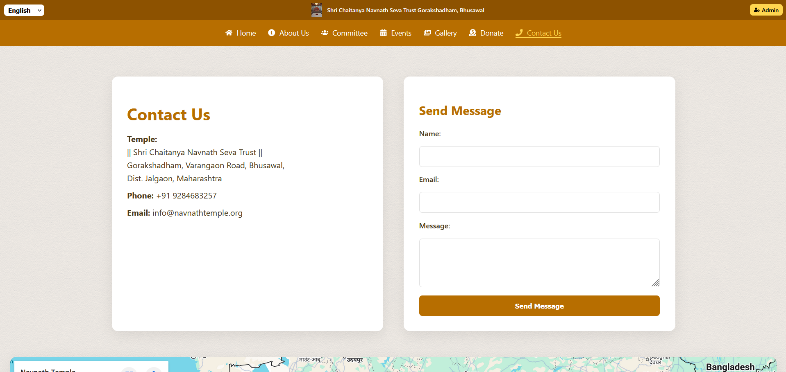
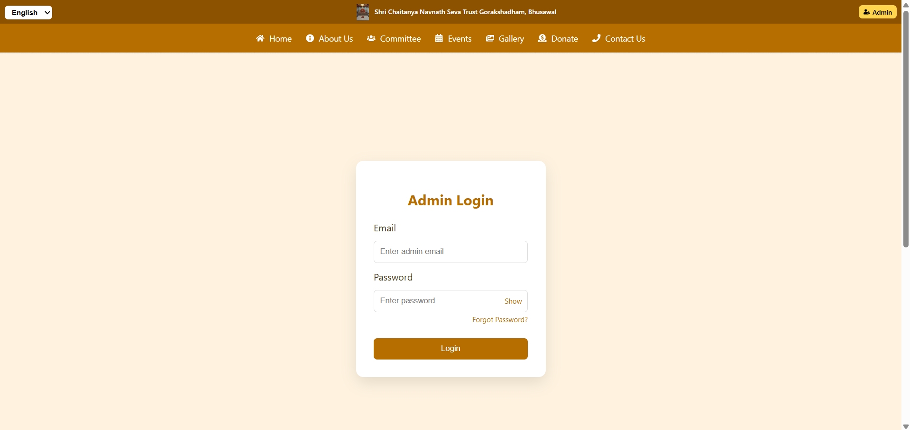
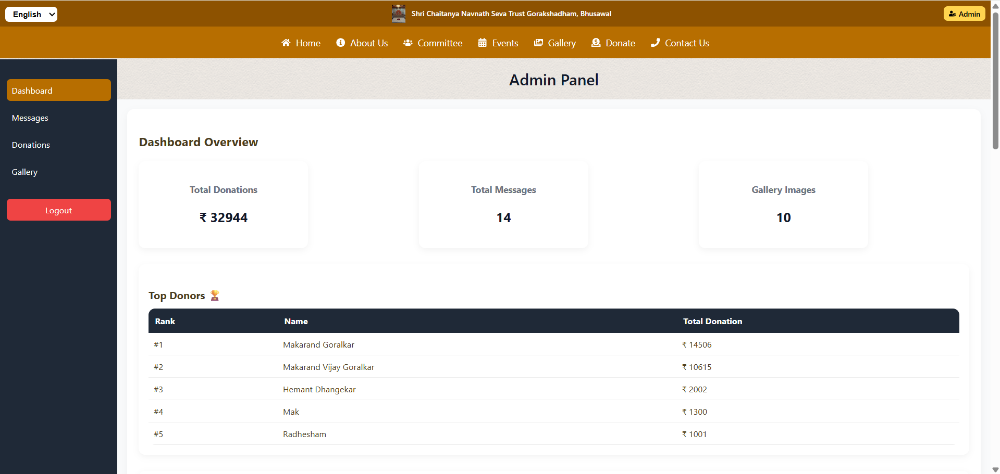

# 🛕 Shri Chaitanya Navnath Seva Trust Gorakshadham, Bhusawal

A modern Temple Management Website built using React.js and Firebase.

The platform provides information about the temple, committee members, events, gallery, donations, contact details, and an admin dashboard for content management.

---

## 🌐 Live Application

### Website

https://navnath-temple.web.app/

### Admin Login

https://navnath-temple.web.app/admin-login

### GitHub Repository

https://github.com/Makarandgoralkar/navnath-temple

---

## ✨ Features

### 🏠 Home Page

- Hero Slider
- Temple Introduction
- Live Darshan Button
- Donation CTA
- Fully Responsive Design

### 📖 About Us

- Temple History
- Temple Journey Timeline
- Temple Statistics & Milestones
- Mission & Vision

### 👥 Committee

- Committee Members Showcase
- Designation Details
- Member Profiles

### 📅 Events

- Darshan Timings
- Upcoming Events
- Festival Information
- Religious Programs

### 🖼️ Gallery

- Temple Photos
- Event Photos
- Responsive Image Gallery
- Lightbox Preview

### 💰 Donate

- Online Donation Form
- Multiple Donation Categories
- Donor Information Collection

### 📞 Contact Us

- Temple Contact Information
- Contact Form
- Location Details

### 🔐 Admin Dashboard

- Secure Admin Authentication
- Manage Gallery Images
- Manage Temple Content
- View Donation & Contact Submissions
- Protected Admin Routes

---

## 🛠️ Tech Stack

### Frontend

- React.js
- React Router DOM
- CSS3
- React Icons

### Backend

- Firebase Authentication
- Firebase Realtime Database

### Hosting

- Firebase Hosting

---

## 📂 Project Structure

```text
src/
│
├── components/
│   ├── Home.js
│   ├── About.js
│   ├── Committee.js
│   ├── Events.js
│   ├── Gallery.js
│   ├── Donate.js
│   ├── Contact.js
│   ├── Navbar.js
│   ├── Footer.js
│   ├── PrivacyPolicy.js
│   ├── TermsConditions.js
│   ├── AdminLogin.js
│   ├── AdminDashboard.js
│   └── ProtectedRoute.js
│
├── firebase.js
├── ScrollToTop.js
├── App.js
└── index.js
```

---

## 🔗 Routes

| Route | Description |
|---------|-------------|
| / | Home Page |
| /about | About Temple |
| /committee | Committee Members |
| /events | Temple Events |
| /gallery | Gallery |
| /donate | Donation Page |
| /contact | Contact Page |
| /privacy-policy | Privacy Policy |
| /terms-conditions | Terms & Conditions |
| /admin-login | Admin Login |
| /admin-dashboard | Admin Dashboard |

---

## 🚀 Installation

Clone the repository:

```bash
git clone https://github.com/Makarandgoralkar/navnath-temple.git
```

Move into the project directory:

```bash
cd navnath-temple
```

Install dependencies:

```bash
npm install
```

Run the project locally:

```bash
npm start
```

Open:

```text
http://localhost:3000
```

---

## 🚀 Build For Production

```bash
npm run build
```

---

## ☁️ Firebase Deployment

```bash
npm run build
firebase deploy
```

---

## 🔒 Authentication

Admin Dashboard is protected using Firebase Authentication.

Protected Route:

```text
/admin-dashboard
```

Only authenticated administrators can access dashboard features.

---

## 📜 Legal Pages

- Privacy Policy
- Terms & Conditions

---

## 📞 Contact

### Shri Chaitanya Navnath Seva Trust Gorakshadham

📍 Gorakshadham, Varangaon Road, Bhusawal, Dist. Jalgaon, Maharashtra, India

📞 +91 9284683257

📧 info@navnathtemple.org

🌐 https://navnath-temple.web.app/

---

## 📸 Screenshots

### 🏠 Home Page



### 📖 About Us



### 👥 Committee Page



### 📅 Events Page



### 🖼️ Gallery Page



### 💰 Donate Page



### 📞 Contact Page



### 🔐 Admin Login



### 📊 Admin Dashboard



---

## 👨‍💻 Developer

### Makarand Goralkar

Full Stack Developer

📧 makarandgoralkar27@gmail.com

GitHub:
https://github.com/Makarandgoralkar

LinkedIn:
https://www.linkedin.com/in/makarand-goralkar-505788258/

---

## 📄 License

This project is developed for Shri Chaitanya Navnath Seva Trust Gorakshadham, Bhusawal.

© 2026 Shri Chaitanya Navnath Seva Trust | All Rights Reserved.